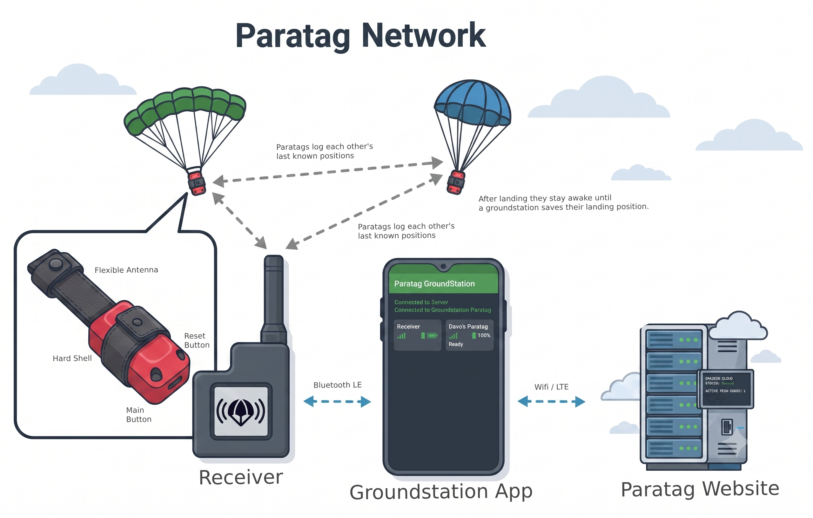
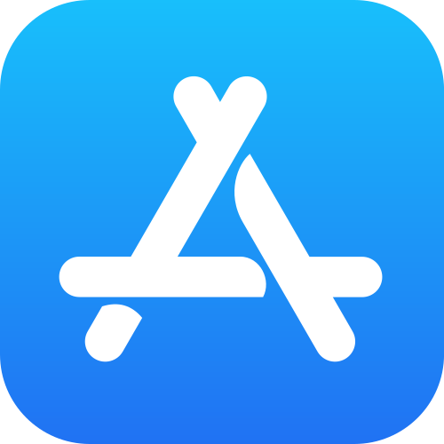
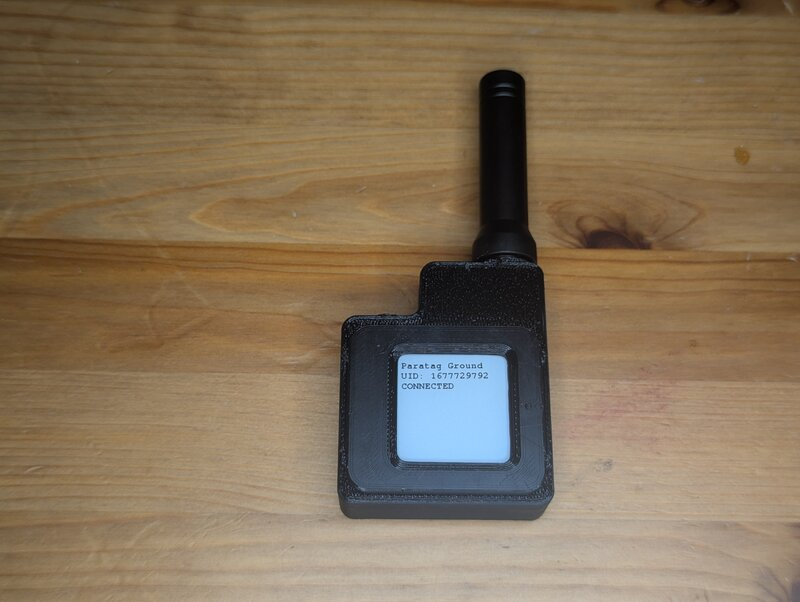
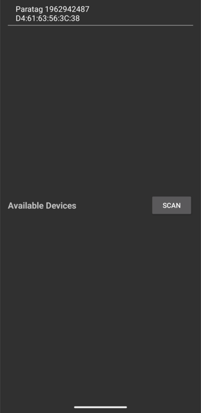
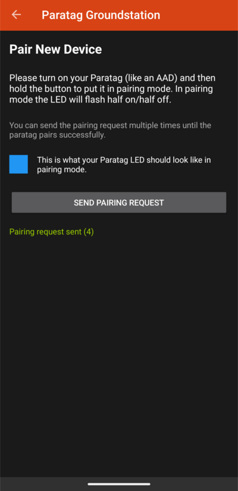
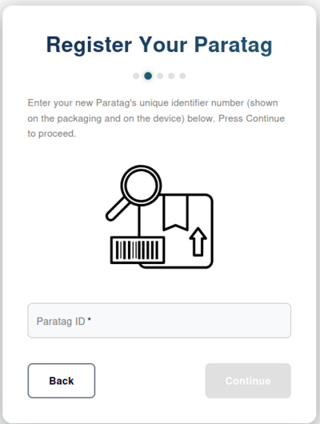
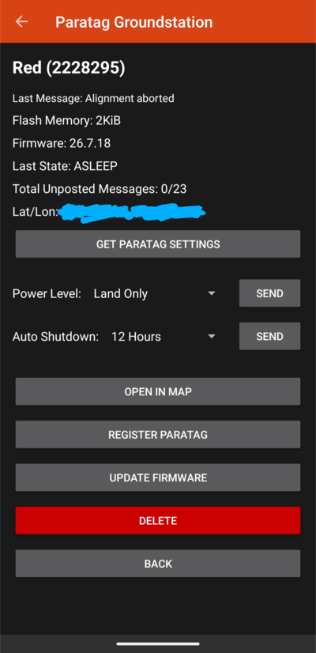
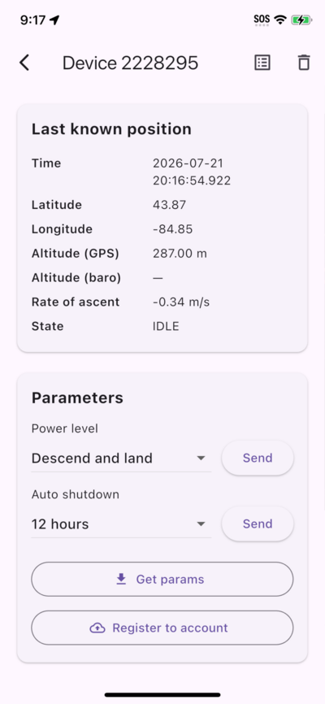
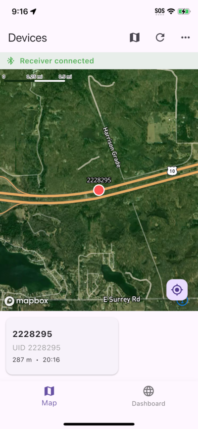

# Paratag User Manual

## Disclaimer

Skydiving is an inherently dangerous activity. Mounting any device to a parachute system introduces additional risk. It is the sole responsibility of the skydiver jumping with Paratag to have their installation approved by a current, certified rigger to assess whether mounting a Paratag is appropriate for their equipment and jump conditions. By using Paratag you accept all risks of injury or death resulting from use or misuse of this device.

---

## Paratag Overview

Paratag is a small GPS transmitter designed to be mounted on a skydiving rig. It transmits its position over radio to a ground receiver, which relays the data to a phone app and cloud server in real time.

  <a href="https://www.youtube.com/playlist?list=PLRnppc4hiiLs" title="Paratag How-To Guide — Watch on YouTube">
     
    ▶&nbsp;Watch the How-To Guide on YouTube
  </a>
   
   
   

### Mounting

<!-- TODO: describe recommended mounting location on the rig, hardware required, TSO/PMA considerations -->

### Using the Buttons

| Press | Meaning |
|---------|---------|
| AAD Tap Sequence | Turn on / Turn off |
| Short tap | Wake Radio  Transmit STATUS message Check GPS Alignment |
| Hold | Pairing mode |
| Double tap | Cancel GPS Alignment |

### LEDs

| Pattern | Meaning | Animation |
|---------|---------|---------|
| One short Blink | Paratag turned Off | 

 |
| Long blink with a brief gap | Paratag turned On | 

 |
| **Repeating:** |  | |
| Heartbeat | GPS Aligning | 

 |
| Occasional Blink | Transmitting / Waiting for landing acknowledgement | 

 |
| Half on / half off (blue) | Pairing mode | 

 |

---

## App Status

| Feature | Android | iOS |
|---------|:-------:|:-------:|
|Download Link|[ Google Play](https://play.google.com/store/apps/details?id=com.flyparatag.groundstation)|[ Public Beta Still in review by Apple](https://testflight.apple.com/join/Mu6J4kQU)|
| Receive live Paratag positions | ✅ | ✅ |
| Change Paratag settings | ✅ | ✅ |
| Receive live Paratag positions | ✅ | ✅ |
| Receive live Paratag positions | ✅ | ✅ |
| Download logs | ✅ | ❌ |
| OTA Firmware Updates | ✅ | ❌ |

### Creating a Paratag Account / Signing In

<!-- TODO -->

### Connecting to the Bluetooth Receiver

The app connects to a receiver over Bluetooth.

<!-- TODO: describe how to pair the phone to the receiver for the first time -->

  

### Pairing a New Paratag via the App

1. Turn on the Paratag (like an AAD).
2. Hold the button until the LED flashes blue (half on / half off) — this is pairing mode.
3. In the app, open **Pair New Device** and tap **SEND PAIRING REQUEST**.
4. Repeat until the app confirms pairing succeeded.

### Register a Paired Paratag to Your Account

Visit https://app.flyparatag.com/#/registerdevice to begin registering a paratag to your account. It will ask you about a Paratag ID. This is the unique identifier number assigned to your Paratag, and will appear in your app

After pairing, open the device detail screen and tap **REGISTER PARATAG** (Android) or **Register to account** (iOS) to associate the beacon with your online account.

  
  

### Seeing All Paratag Devices

The main screen lists your paired beacons, other beacons heard by the receiver, and the receiver itself. Each card shows the last-seen time, battery level, and current state.

### Device Details Screen

Tapping a device shows its last known GPS position, altitude, rate of ascent, state, flash memory usage, firmware version, and configurable parameters (power level, auto-shutdown timer).

---

## Website

<!-- TODO: URL for the Paratag web portal -->

### Jump Logs

<!-- TODO: describe how completed jumps appear in the web portal, filtering, export -->

### Live Streaming Jump Data

<!-- TODO: describe real-time tracking view during an active jump -->

